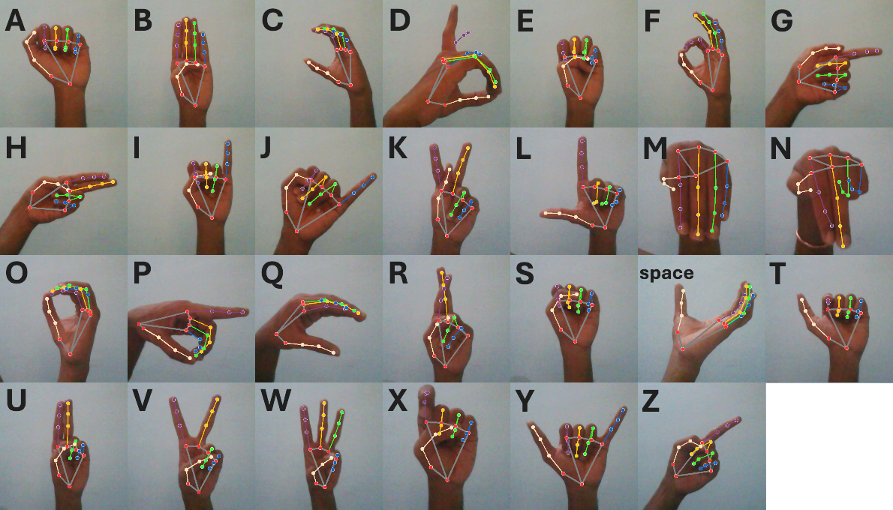

# Fingertalk
## American Sign Language Recognition

Use a random forest classifier to recognize American Sign Language (ASL) signs from images. The images are first processed by mediapipe to extract hand landmarks, which are then used as features for the classifier. The model is trained on a dataset of ASL signs and can be used to predict the sign from a new image.

```python ./hand_detection_RFC.py```




### Requirements
- Python 3.7 or higher
- mediapipe
- opencv-python
- numpy
- scikit-learn
- pickle